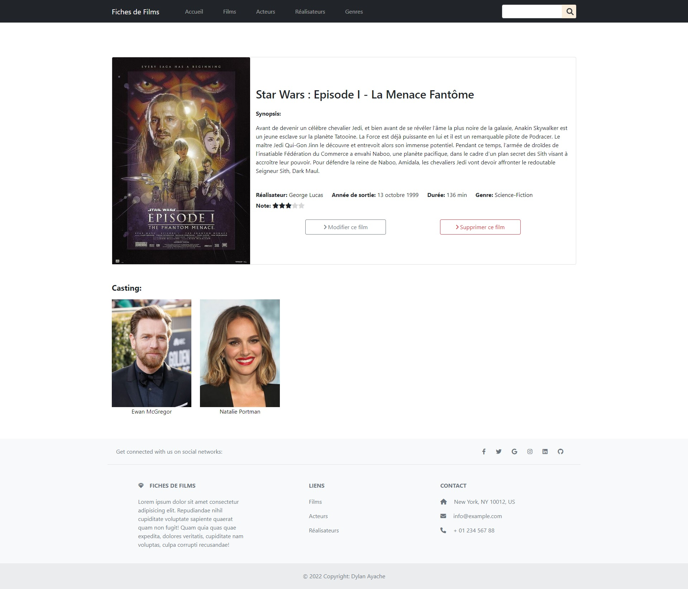

# Backend Project - Movies cards App

## Welcome! 👋

Thanks for checking out this back-end personal project.

## The Project

It's a movie information app in PHP OOP, with a MySQL database made with phpMyAdmin in a MVC architecture.

The functionalities are :
- Checking a full page of movies, actors, directors and gender
- Checking a single page of movie card by id
- Adding, Deleting, Modifying a movie
- Having differents clickable informations inside each movie information page (Director, Casting, Gender)
- Having a full recap page with the products in cart, having the possibility to manage the quantity and to see the final price

Stacks used :
- PHP POO

Css extension :
- Sass

Framework :
- Bootstrap
 
**Don't hesitate to contact me for further informations!** 🚀
